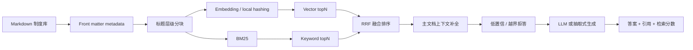

# SmartOfficeRAG：企业内部制度知识问答系统

SmartOfficeRAG 是一个面向 RAG/大模型应用工程岗展示的企业内部政策问答项目。项目使用自制模拟制度数据，覆盖 HR、财务、IT、信息安全、行政、法务、采购、内审和运营等场景，目标是解决企业制度分散、员工重复咨询、人工答疑成本高、答案难追溯的问题。

系统支持制度解析、结构化 metadata、标题分块、向量检索、BM25、RRF 融合排序、低置信拒答、来源引用、离线评估和 Streamlit 可解释化展示。没有 LLM API key 时会自动使用本地抽取式回答，便于面试演示和云端部署。

## 业务目标

- 员工侧：用自然语言查询制度、流程、材料、时限和风险注意事项。
- 支持团队侧：减少 HR、财务、IT、安全等重复咨询，并保留可追溯引用。
- 风控侧：对客户数据、生产系统、付款、合同、印章、监管报送等高风险问题强调审批和留痕。
- 工程侧：把 RAG 从 Demo 做成可解释、可评估、可部署、可迭代的闭环系统。

## 核心链路



当前固定检索策略：

1. metadata filter：按部门、流程类型、风险等级过滤。
2. vector topN + BM25 topN：同时覆盖语义相似和关键词精确匹配。
3. RRF 融合：降低单一路径误召回风险。
4. 文档级排序：对 BM25 精确命中的制度加权，避免弱向量噪声覆盖强业务词。
5. 主文档上下文补全：补齐同一制度下的步骤、材料、SLA、注意事项。
6. 低置信拒答：知识库外或证据不足时不继续调用 LLM。
7. 可信生成：回答固定包含结论、处理步骤、所需材料、注意事项和引用来源。

## 当前数据、评估与实验历程

评估集位于 `data/eval/eval_cases.jsonl`，当前包含 232 条问题：

- 210 条知识库内问题：流程类、材料类、时限类、合规类、系统入口类、同义改写类、模糊追问类。
- 22 条知识库外拒答问题：股票、个税、停车、食堂、私人福利等不在制度库范围内的问题。

运行 `evaluate.py` 会生成单次评估报告 `eval_report.json` 和 `eval_report.md`。运行 `run_experiments.py --quick` 或 `run_experiments.py --full` 会生成真实迭代实验报告：

```text
docs/EXPERIMENT_REPORT.md
experiments/results/experiment_report.json
experiments/results/experiment_report.csv
```

当前实验不是把最终结果包装成满分，而是保留从 baseline 到最终选型的过程。`--full` 模式会尝试运行已缓存的真实 embedding 模型；未缓存模型会标记 skipped，不伪造数据。

迭代结果摘要：

| Version | 关键策略 | Answer Acc. | Hit@5 | Citation Acc. | Refusal Acc. |
| --- | --- | ---: | ---: | ---: | ---: |
| V0 | LLM direct，无知识库 | 0.000 | 0.000 | 0.095 | 0.000 |
| V1 | 整文档关键词检索 | 0.416 | 0.995 | 0.184 | 0.045 |
| V2 | 固定窗口 chunk + BM25 | 0.555 | 1.000 | 0.372 | 0.182 |
| V3 | Markdown header chunk + BM25 | 0.484 | 1.000 | 0.840 | 0.045 |
| V4-bge-small | bge-small + FAISS，纯向量检索 | 0.454 | 0.862 | 0.305 | 0.000 |
| V4-bge-base | bge-base + FAISS，纯向量检索 | 0.475 | 0.881 | 0.369 | 0.000 |
| V4-e5 | multilingual-e5 + FAISS，纯向量检索 | 0.457 | 0.829 | 0.402 | 0.000 |
| V5 | BM25 + vector + RRF | 0.533 | 0.990 | 0.897 | 0.000 |
| V6-bge-base | bge-base + BM25 + RRF + 拒答 | 0.573 | 0.990 | 0.983 | 1.000 |
| V6-bge-small | bge-small + BM25 + RRF + 拒答（部署选型） | 0.570 | 0.990 | 0.983 | 1.000 |
| V6-e5 | multilingual-e5 + BM25 + RRF + 拒答 | 0.566 | 0.990 | 0.983 | 1.000 |
| V7 | Query rewrite + metadata hint | 0.527 | 0.952 | 0.948 | 1.000 |

实验结论：在线 full 实验已经完整跑通 bge-small、bge-base 和 multilingual-e5。bge-base 的 Answer Accuracy Proxy 最高，但相对 bge-small 只提升 0.003，Hit@5、Citation Accuracy、Refusal Accuracy 完全一致，而 p95 延迟明显更高；因此部署选型选择 bge-small + BM25 + RRF + 低置信拒答。V7 说明“规则增强不是越多越好”，当前样本下 query rewrite 和 metadata hint 会把部分相似制度引向错误部门。

单次最终链路评估结果：

| 指标 | Hybrid RAG |
| --- | ---: |
| Hit@5 / Recall@5 | 0.990 / 0.990 |
| Context Precision@5 | 0.990 |
| MRR@5 / nDCG@5 | 0.990 / 0.990 |
| Citation Accuracy | 0.983 |
| Refusal Accuracy | 1.000 |
| Faithfulness Proxy | 0.991 |
| Latency p50 / p95 | 2.6 ms / 3.8 ms |

说明：`local-hashing` 只作为快速可复现 fallback，不作为最终 embedding 选型依据；完整实验默认在线运行并下载/缓存真实 embedding 模型，离线模式只用于已有缓存复现。

## 运行方式

安装轻量 Demo 依赖：

```powershell
cd D:\projects\enterprise-knowledge-rag
python -m venv .venv
.\.venv\Scripts\python.exe -m pip install --upgrade pip
.\.venv\Scripts\python.exe -m pip install --prefer-binary -r requirements.txt
```

启动 Web Demo：

```powershell
.\.venv\Scripts\python.exe run_web_demo.py
```

打开：

```text
http://localhost:8501
```

命令行快速测试：

```powershell
.\.venv\Scripts\python.exe cli.py "新员工如何申请邮箱和 VPN 权限？"
```

运行评估：

```powershell
.\.venv\Scripts\python.exe evaluate.py
```

运行真实迭代实验：

```powershell
.\.venv\Scripts\python.exe run_experiments.py --quick
.\.venv\Scripts\python.exe run_experiments.py --full
```

如果只想用本机缓存复现，可显式离线运行：

```powershell
.\.venv\Scripts\python.exe run_experiments.py --full --offline --allow-skip
```

如需完整向量模型和 FAISS：

```powershell
.\.venv\Scripts\python.exe -m pip install --prefer-binary -r requirements-full.txt
$env:SMARTOFFICE_USE_VECTOR="1"
$env:HF_HOME="D:\projects\enterprise-knowledge-rag\.cache\huggingface"
```

如需接入 DeepSeek 或 OpenAI-compatible API：

```powershell
$env:DEEPSEEK_API_KEY="你的 DeepSeek API Key"
```

离线评估默认禁用 LLM 调用，避免成本和网络波动：

```powershell
$env:SMARTOFFICE_DISABLE_LLM="1"
```

## Streamlit 展示内容

`app.py` 是公开部署入口，页面展示：

- 制度文档数、检索片段数、评估问题数、Hit@5、引用准确率、p95 延迟。
- 部门、流程类型、风险等级 metadata 过滤。
- 回答、引用来源、端到端耗时、拒答状态、拒答原因。
- 每个召回片段的 `vector_score`、`bm25_score`、`rrf_score`、`doc_id`、`section`、`risk_level`。
- 离线评估中的策略对比、研发迭代实验历程和 Top failure cases。

## 成本与稳定性设计

- 本地缓存 Hugging Face 模型，向量索引持久化到 `vector_index/`。
- 无 API key 时使用抽取式模板，保证面试和云端 Demo 稳定可用。
- 低置信和知识库外问题跳过 LLM 生成，降低幻觉和调用成本。
- 公开数据全部为模拟制度，不包含真实企业隐私或版权材料。
- `requirements.txt` 面向轻量云端部署，`requirements-full.txt` 面向完整本地向量体验。

## 面试讲述要点

- 为什么做：企业制度散落在多个系统里，员工问法自然且重复，人工答复既耗时又难保证引用一致。
- 怎么定义可用：知识库内问题要召回正确制度并给出引用，知识库外问题要拒答，高风险流程要提示审批和留痕。
- 为什么不是纯 LLM：纯 LLM 无法保证制度依据和引用，容易编造流程。
- 为什么混合检索：BM25 擅长制度名、表单号、系统名等精确词；向量检索覆盖同义问法；RRF 提供可解释融合。
- 怎么评估：用 232 条样本覆盖流程、材料、时限、合规、同义改写、模糊追问和拒答，输出 Hit@5、MRR、Citation Accuracy、Refusal Accuracy、p95 latency。
- 怎么迭代：从 V0 无检索 baseline 出发，逐步测试整文档、固定窗口、标题分块、bge-small/bge-base/e5、混合检索、RRF 和拒答；最终基于准确率、引用准确率、拒答准确率和 p95 延迟选择 bge-small 混合检索链路。

## 简历描述

**SmartOfficeRAG：企业内部制度知识问答系统｜个人项目**

- 面向企业 HR、财务、IT、安全等制度咨询场景，针对“制度分散、员工重复咨询、答案难追溯”的痛点，构建可本地部署的 RAG 问答系统，支持政策查询、流程解释、材料清单、风险提醒和引用溯源。
- 设计 Markdown 制度知识库与结构化 metadata，完成文档解析、标题分块、向量索引持久化和部门/流程/风险等级过滤，沉淀 30 篇企业制度与 232 条评估样本。
- 基于 232 条制度问答评估集建立真实迭代实验，从 LLM 直答 baseline 出发，依次验证整文档检索、固定窗口分块、Markdown 标题分块、bge-small/bge-base/e5 embedding、BM25+向量混合检索、RRF 融合与低置信拒答，使 Answer Accuracy Proxy 从 0.000 提升至 0.570，Citation Accuracy 从 0.095 提升至 0.983，Refusal Accuracy 从 0.000 提升至 1.000。
- 实现 BM25 与向量召回的混合检索链路，使用 RRF 融合排序，并结合主文档上下文补全和低置信拒答策略；实验发现 bge-base 准确率略高但延迟成本明显更高，bge-small 在核心指标持平下延迟更低，因此最终选用 bge-small + Hybrid RRF + 拒答门控作为部署方案。
- 基于 Streamlit 部署可交互 Demo，展示回答、引用来源、检索片段、检索分数和评估指标；无 API key 时支持本地抽取式兜底，兼顾演示稳定性与调用成本。
