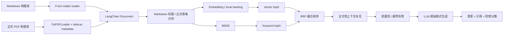

# SmartOfficeRAG：企业内部制度知识问答系统

SmartOfficeRAG 是一个面向企业内部政策咨询场景的 RAG 问答项目。项目使用自制模拟制度数据，覆盖 HR、财务、IT、信息安全、行政、法务、采购、内审和运营等场景，目标是解决企业制度分散、员工重复咨询、人工答疑成本高、答案难追溯的问题。

系统支持 Markdown 与 PDF 多格式制度接入、结构化 metadata、正式条款分块、向量检索、BM25、RRF 融合排序、低置信拒答、来源引用、离线评估和 Streamlit 可解释化展示。没有 LLM API key 时会自动使用本地抽取式回答，便于面试演示和云端部署。

## 业务目标

- 员工侧：用自然语言查询制度、流程、材料、时限、金额阈值和风险注意事项。
- 支持团队侧：减少 HR、财务、IT、安全等重复咨询，并保留可追溯引用。
- 风控侧：对客户数据、生产系统、付款、合同、印章、监管报送等高风险问题强调审批和留痕。
- 工程侧：把 RAG 从 Demo 做成可解释、可评估、可部署、可迭代的闭环系统。

## 核心链路



当前固定检索策略：

1. metadata filter：按部门、流程类型、风险等级过滤。
2. vector topN + BM25 topN：同时覆盖语义相似和关键词精确匹配。
3. RRF 融合：降低单一路径误召回风险。
4. 文档级排序：对 BM25 精确命中的制度加权，避免弱向量噪声覆盖强业务词。
5. 主文档上下文补全：补齐同一制度下的步骤、材料、SLA、注意事项。
6. 低置信拒答：知识库外或证据不足时不继续调用 LLM。
7. 可信生成：回答固定包含结论、处理步骤、所需材料、注意事项和引用来源。

## 当前数据、评估与实验历程

制度知识库包含：

- `data/policies/`：30 篇结构化 Markdown 制度，使用 front matter metadata。
- `data/policies_pdf/`：15 篇 baseline PDF + 12 篇 medium/hard 长制度 PDF，每篇配套 `.metadata.json` sidecar。

PDF 已从早期演示型短文档升级为分层正式制度资料库，文档包含公司名称、制度编号、版本号、发布日期、生效日期、适用范围、修订记录、正文条款、附件、审批流程、解释权归属、页眉页脚和表格。新增 medium/hard 文档包含 8 页长制度、跨制度引用、版本冲突、补充通知优先级、金额阈值和例外条款。PDF 正文不再包含 Markdown `#`、`---` 或 front matter；结构化字段全部来自 sidecar metadata。

PDF 主链路默认使用 LangChain `PyPDFLoader`。这是本项目的工程选择，不是兜底：当前 PDF 是数字文本制度，`PyPDFLoader` 更轻、更稳定、更适合 Streamlit 和本地演示。`UnstructuredPDFLoader` 仅作为扫描件、复杂表格或版式 PDF 的可选增强依赖，放在 `requirements-pdf-advanced.txt`，不进入本轮正式实验主链路。

评估脚本现在读取 `data/eval/*.jsonl`：

- `data/eval/eval_cases.jsonl`：Markdown 制度评估集。
- `data/eval/pdf_eval_cases.jsonl`：PDF 专属评估集。
- `data/eval/medium_eval_cases.jsonl`：长制度、表格、附件和跨制度引用评估集。
- `data/eval/hard_eval_cases.jsonl`：版本冲突、优先级、多跳、相似条款和拒答困难集。

当前分层评估规模为 468 条问题，其中 baseline 324 条、medium 48 条、hard 96 条。运行 `evaluate.py` 会生成：

```text
eval_report.json
eval_report.md
```

当前单次最终链路评估结果：

| 指标 | Hybrid RAG |
| --- | ---: |
| Policy Documents | 57 |
| Chunks | 1331 |
| Total Eval Cases | 468 |
| Hit@5 / Recall@5 | 0.903 / 0.903 |
| Context Precision@5 | 0.903 |
| MRR@5 / nDCG@5 | 0.903 / 0.903 |
| Citation Accuracy | 0.901 |
| Refusal Accuracy | 1.000 |
| Faithfulness Proxy | 0.910 |
| Answer Accuracy Proxy | 0.476 |
| Latency p50 / p95 | 25.7 ms / 34.5 ms |

运行 `run_experiments.py --quick` 或 `run_experiments.py --full` 会生成真实迭代实验报告：

```text
docs/EXPERIMENT_REPORT.md
experiments/results/experiment_report.json
experiments/results/experiment_report.csv
```

当前实验已经基于 57 份制度和 468 条评估样本形成分层 benchmark。baseline 用于验证传统 RAG 链路，medium/hard 用于验证长文档、表格、版本冲突、优先级和多跳问题。真实 embedding 模型均从本地 Hugging Face 缓存加载，没有使用 fallback。已完成对比：`BAAI/bge-small-zh-v1.5`、`BAAI/bge-base-zh-v1.5`、`intfloat/multilingual-e5-small`，并扩展复验 MTEB/C-MTEB 候选模型 `Qwen/Qwen3-Embedding-0.6B`、`BAAI/bge-m3`、`Alibaba-NLP/gte-Qwen2-1.5B-instruct`。

full 迭代结果摘要：

| Version | 关键策略 | Answer Acc. | Hit@5 | Citation Acc. | Refusal Acc. |
| --- | --- | ---: | ---: | ---: | ---: |
| V0 | LLM direct，无知识库 | 0.000 | 0.000 | 0.074 | 0.000 |
| V1 | 整文档关键词检索 | 0.382 | 0.997 | 0.188 | 0.042 |
| V2 | 固定窗口 chunk + BM25 | 0.508 | 1.000 | 0.458 | 0.042 |
| V3 | Markdown/PDF 结构分块 + BM25 | 0.416 | 0.973 | 0.794 | 0.042 |
| V4-local | local-hashing + NumPy，纯向量检索 | 0.221 | 0.783 | 0.332 | 0.000 |
| V4-bge-small | bge-small + FAISS，纯向量检索 | 0.363 | 0.883 | 0.386 | 0.000 |
| V4-bge-base | bge-base + FAISS，纯向量检索 | 0.388 | 0.883 | 0.417 | 0.000 |
| V4-e5 | multilingual-e5 + FAISS，纯向量检索 | 0.362 | 0.847 | 0.406 | 0.000 |
| V6-local | local-hashing + BM25 + RRF + 拒答 | 0.440 | 0.903 | 0.901 | 1.000 |
| V6-bge-small | bge-small + BM25 + RRF + 拒答 | 0.476 | 0.903 | 0.901 | 1.000 |
| V6-bge-base | bge-base + BM25 + RRF + 拒答 | 0.475 | 0.903 | 0.901 | 1.000 |
| V6-e5 | multilingual-e5 + BM25 + RRF + 拒答 | 0.469 | 0.903 | 0.901 | 1.000 |
| V6-recursive | 递归字符分块 + bge-small + RRF + 拒答 | 0.565 | 0.963 | 0.531 | 1.000 |
| V6-semantic | 语义分块 + bge-small + RRF + 拒答 | 0.479 | 0.903 | 0.901 | 1.000 |
| V9-qwen3-0.6b | Qwen3-Embedding-0.6B + BM25 + RRF + 拒答 | 0.472 | 0.910 | 0.907 | 1.000 |
| V9-bge-m3 | bge-m3 + BM25 + RRF + 拒答 | 0.484 | 0.900 | 0.898 | 1.000 |
| V9-gte-qwen2-1.5b | gte-Qwen2-1.5B + BM25 + RRF + 拒答 | skipped | - | - | - |
| V10-sentence-window-hybrid | 句子窗口索引 + BM25 + RRF + 拒答 | 0.398 | 0.907 | 0.904 | 1.000 |
| V11-structured-hybrid | 结构化 metadata boost + BM25 + RRF + 拒答 | 0.487 | 0.880 | 0.880 | 1.000 |
| V12-sentence-structured-hybrid | 句子窗口 + 结构化 boost + RRF + 拒答 | 0.372 | 0.897 | 0.895 | 1.000 |

说明：`local-hashing` 只作为快速可复现 baseline；baseline full 实验显示 bge-small/base/e5 在 Hit@5、Citation Accuracy、Refusal Accuracy 上接近，bge-small 在延迟和稳定性上最均衡。hard 定向 full 实验显示，`V11-hard-structured` 将版本冲突类指标从 0.500 提升到 1.000；`bge-m3` 将 hard Answer 从 0.558 提升到 0.604，但 p95 从 45.5ms 增加到 143.1ms；Qwen3 真实加载成功但 Answer 与延迟均不占优。因此默认主链路仍选择 `BAAI/bge-small-zh-v1.5 + BM25 + RRF + 低置信拒答`，structured boost 和 bge-m3 作为困难场景增强候选。

分块实验结论：递归字符分块在 Hit@5 和 Answer Accuracy Proxy 上表现更强，但 Citation Accuracy 明显低于制度结构分块；语义分块与结构分块的 Citation Accuracy 持平，Answer Accuracy Proxy 略高，但需要额外 embedding 分块成本。因此本项目部署主策略仍选择 Markdown header / PDF 章条结构感知分块，递归分块作为通用 fallback，语义分块作为后续增强候选。

索引优化结论：简单库上 sentence-window 和 structured boost 没有全面超过 V6；hard 集上 structured metadata boost 开始体现价值，能改善版本冲突和优先级问题，但会牺牲部分 Answer。当前主链路仍保留 `结构感知 chunk + FAISS + BM25 + RRF + 主文档上下文补全 + 低置信拒答`，困难场景可启用 structured boost。

## 运行方式

安装轻量 Demo 依赖：

```powershell
cd D:\projects\enterprise-knowledge-rag
python -m venv .venv
.\.venv\Scripts\python.exe -m pip install --upgrade pip
.\.venv\Scripts\python.exe -m pip install --prefer-binary -r requirements.txt
```

如需本地完整向量体验和 FAISS：

```powershell
.\.venv\Scripts\python.exe -m pip install --prefer-binary -r requirements-full.txt
$env:SMARTOFFICE_USE_VECTOR="1"
$env:HF_HOME="D:\projects\enterprise-knowledge-rag\.cache\huggingface"
$env:SMARTOFFICE_EMBEDDING_LOCAL_ONLY="1"
```

如需额外实验复杂 PDF 解析，再单独安装：

```powershell
.\.venv\Scripts\python.exe -m pip install --prefer-binary -r requirements-pdf-advanced.txt
$env:SMARTOFFICE_PDF_LOADER="unstructured"
```

主链路不需要设置 `SMARTOFFICE_PDF_LOADER`，默认就是 `pypdf`。

启动 Web Demo：

```powershell
.\.venv\Scripts\python.exe run_web_demo.py
```

打开：

```text
http://localhost:8501
```

命令行快速测试：

```powershell
.\.venv\Scripts\python.exe cli.py "新员工如何申请邮箱和 VPN 权限？"
```

运行评估：

```powershell
.\.venv\Scripts\python.exe evaluate.py
```

运行真实迭代实验：

```powershell
.\.venv\Scripts\python.exe run_experiments.py --quick
.\.venv\Scripts\python.exe run_experiments.py --full
```

如果只想用本机缓存复现，可显式离线运行：

```powershell
.\.venv\Scripts\python.exe run_experiments.py --full --offline --allow-skip
.\.venv\Scripts\python.exe run_experiments.py --full --offline --allow-skip --config-pattern v*_hard*.json
```

如需接入 DeepSeek 或 OpenAI-compatible API：

```powershell
$env:DEEPSEEK_API_KEY="你的 DeepSeek API Key"
```

离线评估默认禁用 LLM 调用，避免成本和网络波动：

```powershell
$env:SMARTOFFICE_DISABLE_LLM="1"
```

## Streamlit 展示内容

`app.py` 是公开部署入口，页面展示：

- 制度文档数、检索片段数、评估问题数、Hit@5、引用准确率、p95 延迟。
- 部门、流程类型、风险等级 metadata 过滤。
- 回答、引用来源、端到端耗时、拒答状态、拒答原因。
- 每个召回片段的 `vector_score`、`bm25_score`、`rrf_score`、`doc_id`、`section`、`risk_level`。
- 离线评估中的策略对比、研发迭代实验历程和 Top failure cases。

## 成本与稳定性设计

- 本地缓存 Hugging Face 模型，向量索引持久化到 `vector_index/`。
- 无 API key 时使用抽取式模板，保证面试和云端 Demo 稳定可用。
- 低置信和知识库外问题跳过 LLM 生成，降低幻觉和调用成本。
- 公开数据全部为模拟制度，不包含真实企业隐私或版权材料。
- `requirements.txt` 面向轻量云端部署，包含 `PyPDFLoader` 所需的 `langchain-community` 和 `pypdf`。
- `requirements-full.txt` 面向完整本地向量体验，包含 `sentence-transformers`、`faiss-cpu`、`reportlab`，不包含 `unstructured[pdf]`。
- `requirements-pdf-advanced.txt` 只用于可选复杂 PDF 解析实验。

## 面试讲述要点

- 为什么做：企业制度散落在多个系统里，员工问法自然且重复，人工答复既耗时又难保证引用一致。
- 怎么定义可用：知识库内问题要召回正确制度并给出引用，知识库外问题要拒答，高风险流程要提示审批和留痕。
- 为什么不是纯 LLM：纯 LLM 无法保证制度依据和引用，容易编造流程。
- 为什么混合检索：BM25 擅长制度名、表单号、系统名等精确词；向量检索覆盖同义问法；RRF 提供可解释融合。
- 怎么评估：用 `data/eval/*.jsonl` 覆盖流程、材料、时限、合规、金额阈值、跨文档引用、版本差异和拒答，输出 Hit@5、MRR、Citation Accuracy、Refusal Accuracy、p95 latency。
- 怎么迭代：从 V0 无检索 baseline 出发，逐步测试整文档、固定窗口、标题/章条分块、local-hashing、bge-small、bge-base、multilingual-e5、混合检索、RRF 和拒答；随后构造 medium/hard 分层资料库，验证 structured boost、sentence-window、bge-m3 和 Qwen3 是否在困难样本上出现局部收益。

## 简历描述草稿

**SmartOfficeRAG：企业内部制度知识问答系统｜个人项目**

- 面向企业 HR、财务、IT、安全等制度咨询场景，针对“制度分散、员工重复咨询、答案难追溯”的痛点，构建可本地部署的 RAG 问答系统，支持政策查询、流程解释、材料清单、风险提醒和引用溯源。
- 设计 Markdown + PDF 多格式制度知识库与结构化 metadata，完成文档解析、正式章条分块、向量索引持久化和部门/流程/风险等级过滤，沉淀 57 篇企业模拟制度与 468 条分层评估样本。
- 从 LLM 直答 baseline 出发，依次验证整文档检索、固定窗口分块、结构化分块、纯向量、BM25+向量混合检索、RRF 融合与低置信拒答；真实 full 实验中 Answer Accuracy Proxy 从 0.000 提升至 0.476，Citation Accuracy 从 0.074 提升至 0.901，Refusal Accuracy 从 0.000 提升至 1.000。
- 实现 BM25 与向量召回的混合检索链路，使用 RRF 融合排序，并结合主文档上下文补全和低置信拒答策略；在 hard 集上复验 structured boost、bge-m3 和 Qwen3，发现高级方法存在局部收益但需权衡延迟与引用稳定性。
- 基于 Streamlit 部署可交互 Demo，展示回答、引用来源、检索片段、检索分数和评估指标；无 API key 时支持本地抽取式兜底，兼顾演示稳定性与调用成本。
