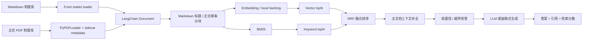

# SmartOfficeRAG：企业内部制度知识问答系统

SmartOfficeRAG 是一个面向企业内部政策咨询场景的 RAG 问答项目。项目使用自制模拟制度数据，覆盖 HR、财务、IT、信息安全、行政、法务、采购、内审和运营等场景，目标是解决企业制度分散、员工重复咨询、人工答疑成本高、答案难追溯的问题。

系统支持 Markdown 与 PDF 多格式制度接入、结构化 metadata、正式条款分块、向量检索、BM25、RRF 融合排序、低置信拒答、来源引用、离线评估和 Streamlit 可解释化展示。没有 LLM API key 时会自动使用本地抽取式回答，便于面试演示和云端部署。

## 业务目标

- 员工侧：用自然语言查询制度、流程、材料、时限、金额阈值和风险注意事项。
- 支持团队侧：减少 HR、财务、IT、安全等重复咨询，并保留可追溯引用。
- 风控侧：对客户数据、生产系统、付款、合同、印章、监管报送等高风险问题强调审批和留痕。
- 工程侧：把 RAG 从 Demo 做成可解释、可评估、可部署、可迭代的闭环系统。

## 核心链路



当前固定检索策略：

1. metadata filter：按部门、流程类型、风险等级过滤。
2. vector topN + BM25 topN：同时覆盖语义相似和关键词精确匹配。
3. RRF 融合：降低单一路径误召回风险。
4. 文档级排序：对 BM25 精确命中的制度加权，避免弱向量噪声覆盖强业务词。
5. 主文档上下文补全：补齐同一制度下的步骤、材料、SLA、注意事项。
6. 低置信拒答：知识库外或证据不足时不继续调用 LLM。
7. 可信生成：回答固定包含结论、处理步骤、所需材料、注意事项和引用来源。

## 当前数据、评估与实验历程

制度知识库包含：

- `data/policies/`：30 篇结构化 Markdown 制度，使用 front matter metadata。
- `data/policies_pdf/`：15 篇正式企业制度 PDF，每篇配套 `.metadata.json` sidecar。

PDF 已从早期演示型短文档升级为正式制度资料库，文档包含公司名称、制度编号、版本号、发布日期、生效日期、适用范围、修订记录、正文条款、附件、审批流程、解释权归属、页眉页脚和表格。PDF 正文不再包含 Markdown `#`、`---` 或 front matter；结构化字段全部来自 sidecar metadata。

PDF 主链路默认使用 LangChain `PyPDFLoader`。这是本项目的工程选择，不是兜底：当前 PDF 是数字文本制度，`PyPDFLoader` 更轻、更稳定、更适合 Streamlit 和本地演示。`UnstructuredPDFLoader` 仅作为扫描件、复杂表格或版式 PDF 的可选增强依赖，放在 `requirements-pdf-advanced.txt`，不进入本轮正式实验主链路。

评估脚本现在读取 `data/eval/*.jsonl`：

- `data/eval/eval_cases.jsonl`：Markdown 制度评估集。
- `data/eval/pdf_eval_cases.jsonl`：PDF 专属评估集。

当前单次评估规模为 324 条问题，其中 300 条知识库内检索问题、24 条知识库外拒答问题。运行 `evaluate.py` 会生成：

```text
eval_report.json
eval_report.md
```

当前单次最终链路评估结果：

| 指标 | Hybrid RAG |
| --- | ---: |
| Policy Documents | 45 |
| Chunks | 833 |
| Total Eval Cases | 324 |
| Hit@5 / Recall@5 | 0.903 / 0.903 |
| Context Precision@5 | 0.903 |
| MRR@5 / nDCG@5 | 0.903 / 0.903 |
| Citation Accuracy | 0.901 |
| Refusal Accuracy | 1.000 |
| Faithfulness Proxy | 0.910 |
| Answer Accuracy Proxy | 0.441 |
| Latency p50 / p95 | 10.1 ms / 16.5 ms |

运行 `run_experiments.py --quick` 会生成真实迭代实验报告：

```text
docs/EXPERIMENT_REPORT.md
experiments/results/experiment_report.json
experiments/results/experiment_report.csv
```

当前 quick 实验已经基于 45 份制度和 324 条评估样本回归通过。`--full` 会在线下载/加载真实 embedding 模型对比 bge-small、bge-base、multilingual-e5；如果网络连接 Hugging Face 超时，实验会如实失败或 skipped，不伪造完整模型对比结果。

quick 迭代结果摘要：

| Version | 关键策略 | Answer Acc. | Hit@5 | Citation Acc. | Refusal Acc. |
| --- | --- | ---: | ---: | ---: | ---: |
| V0 | LLM direct，无知识库 | 0.000 | 0.000 | 0.074 | 0.000 |
| V1 | 整文档关键词检索 | 0.368 | 0.947 | 0.178 | 0.042 |
| V2 | 固定窗口 chunk + BM25 | 0.542 | 0.993 | 0.460 | 0.042 |
| V3 | Markdown/PDF 结构分块 + BM25 | 0.536 | 0.963 | 0.764 | 0.042 |
| V4 | local-hashing + NumPy，纯向量检索 | 0.253 | 0.753 | 0.290 | 0.000 |
| V5 | BM25 + vector + RRF | 0.440 | 0.903 | 0.836 | 0.000 |
| V6 | BM25 + vector + RRF + 拒答 | 0.440 | 0.903 | 0.901 | 1.000 |
| V7 | Query rewrite + metadata hint + 拒答 | 0.445 | 0.900 | 0.898 | 1.000 |

说明：`local-hashing` 只作为快速可复现 baseline，不作为最终 embedding 选型依据；真实 embedding 选型需要 `run_experiments.py --full` 完整跑通后再写入简历口径。

## 运行方式

安装轻量 Demo 依赖：

```powershell
cd D:\projects\enterprise-knowledge-rag
python -m venv .venv
.\.venv\Scripts\python.exe -m pip install --upgrade pip
.\.venv\Scripts\python.exe -m pip install --prefer-binary -r requirements.txt
```

如需本地完整向量体验和 FAISS：

```powershell
.\.venv\Scripts\python.exe -m pip install --prefer-binary -r requirements-full.txt
$env:SMARTOFFICE_USE_VECTOR="1"
$env:HF_HOME="D:\projects\enterprise-knowledge-rag\.cache\huggingface"
```

如需额外实验复杂 PDF 解析，再单独安装：

```powershell
.\.venv\Scripts\python.exe -m pip install --prefer-binary -r requirements-pdf-advanced.txt
$env:SMARTOFFICE_PDF_LOADER="unstructured"
```

主链路不需要设置 `SMARTOFFICE_PDF_LOADER`，默认就是 `pypdf`。

启动 Web Demo：

```powershell
.\.venv\Scripts\python.exe run_web_demo.py
```

打开：

```text
http://localhost:8501
```

命令行快速测试：

```powershell
.\.venv\Scripts\python.exe cli.py "新员工如何申请邮箱和 VPN 权限？"
```

运行评估：

```powershell
.\.venv\Scripts\python.exe evaluate.py
```

运行真实迭代实验：

```powershell
.\.venv\Scripts\python.exe run_experiments.py --quick
.\.venv\Scripts\python.exe run_experiments.py --full
```

如果只想用本机缓存复现，可显式离线运行：

```powershell
.\.venv\Scripts\python.exe run_experiments.py --full --offline --allow-skip
```

如需接入 DeepSeek 或 OpenAI-compatible API：

```powershell
$env:DEEPSEEK_API_KEY="你的 DeepSeek API Key"
```

离线评估默认禁用 LLM 调用，避免成本和网络波动：

```powershell
$env:SMARTOFFICE_DISABLE_LLM="1"
```

## Streamlit 展示内容

`app.py` 是公开部署入口，页面展示：

- 制度文档数、检索片段数、评估问题数、Hit@5、引用准确率、p95 延迟。
- 部门、流程类型、风险等级 metadata 过滤。
- 回答、引用来源、端到端耗时、拒答状态、拒答原因。
- 每个召回片段的 `vector_score`、`bm25_score`、`rrf_score`、`doc_id`、`section`、`risk_level`。
- 离线评估中的策略对比、研发迭代实验历程和 Top failure cases。

## 成本与稳定性设计

- 本地缓存 Hugging Face 模型，向量索引持久化到 `vector_index/`。
- 无 API key 时使用抽取式模板，保证面试和云端 Demo 稳定可用。
- 低置信和知识库外问题跳过 LLM 生成，降低幻觉和调用成本。
- 公开数据全部为模拟制度，不包含真实企业隐私或版权材料。
- `requirements.txt` 面向轻量云端部署，包含 `PyPDFLoader` 所需的 `langchain-community` 和 `pypdf`。
- `requirements-full.txt` 面向完整本地向量体验，包含 `sentence-transformers`、`faiss-cpu`、`reportlab`，不包含 `unstructured[pdf]`。
- `requirements-pdf-advanced.txt` 只用于可选复杂 PDF 解析实验。

## 面试讲述要点

- 为什么做：企业制度散落在多个系统里，员工问法自然且重复，人工答复既耗时又难保证引用一致。
- 怎么定义可用：知识库内问题要召回正确制度并给出引用，知识库外问题要拒答，高风险流程要提示审批和留痕。
- 为什么不是纯 LLM：纯 LLM 无法保证制度依据和引用，容易编造流程。
- 为什么混合检索：BM25 擅长制度名、表单号、系统名等精确词；向量检索覆盖同义问法；RRF 提供可解释融合。
- 怎么评估：用 `data/eval/*.jsonl` 覆盖流程、材料、时限、合规、金额阈值、跨文档引用、版本差异和拒答，输出 Hit@5、MRR、Citation Accuracy、Refusal Accuracy、p95 latency。
- 怎么迭代：从 V0 无检索 baseline 出发，逐步测试整文档、固定窗口、标题/章条分块、混合检索、RRF 和拒答；真实 embedding 选型必须以 `--full` 成功结果为准。

## 简历描述草稿

**SmartOfficeRAG：企业内部制度知识问答系统｜个人项目**

- 面向企业 HR、财务、IT、安全等制度咨询场景，针对“制度分散、员工重复咨询、答案难追溯”的痛点，构建可本地部署的 RAG 问答系统，支持政策查询、流程解释、材料清单、风险提醒和引用溯源。
- 设计 Markdown + PDF 多格式制度知识库与结构化 metadata，完成文档解析、正式章条分块、向量索引持久化和部门/流程/风险等级过滤，沉淀 45 篇企业模拟制度与 324 条评估样本。
- 从 LLM 直答 baseline 出发，依次验证整文档检索、固定窗口分块、结构化分块、BM25+向量混合检索、RRF 融合与低置信拒答；当前 quick 回归中 Answer Accuracy Proxy 从 0.000 提升至 0.440，Citation Accuracy 从 0.074 提升至 0.901，Refusal Accuracy 从 0.000 提升至 1.000。
- 实现 BM25 与向量召回的混合检索链路，使用 RRF 融合排序，并结合主文档上下文补全和低置信拒答策略；完整 embedding 模型选型以 `run_experiments.py --full` 成功运行结果为准。
- 基于 Streamlit 部署可交互 Demo，展示回答、引用来源、检索片段、检索分数和评估指标；无 API key 时支持本地抽取式兜底，兼顾演示稳定性与调用成本。
